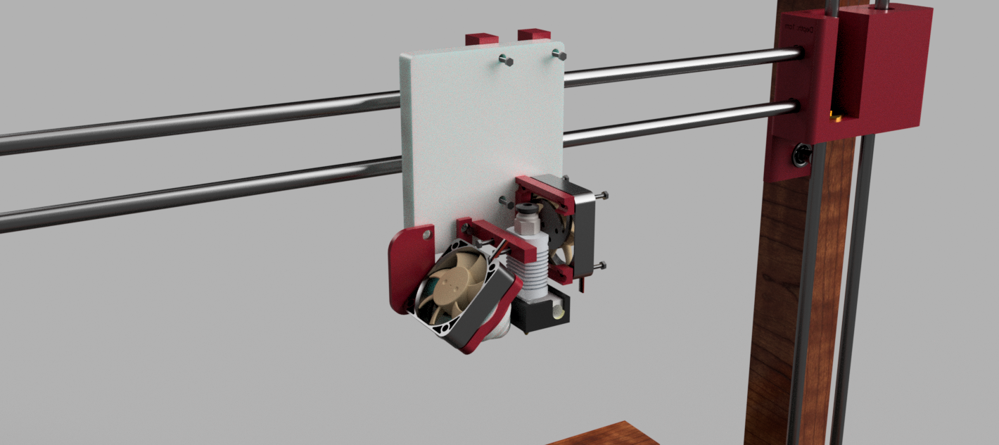
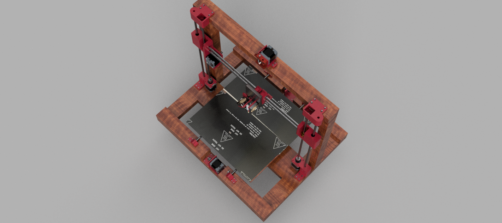
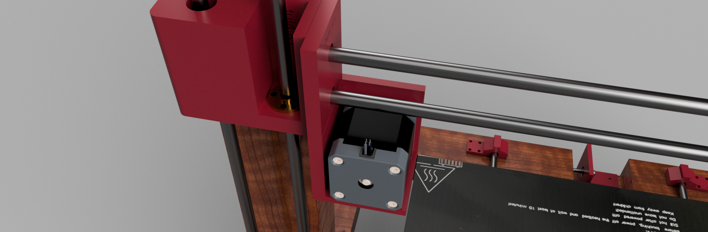

Total time spent: 64h

## Day 1 (06/6) 
> Spent: 4h

I made a lot of research on how 3D printers work, in addition to their different types and what are the different components they share and advantages and disadvantages in components types.

I couldn't find any other on amazon other than the SKR 1.4, which is a great option for as it is 32Bit and enables mutliple beds, i chose the TMC2209 drivers as they enable high accuracy microstepping, which i am planning to combine with low size nozzle (0.3mm) in building high resolution prints.

## Day 2 (07/6)
> Spent: 5h

Continued watching more videos, i was interested in simple cartesian bed slingers, in which i searched about how they are assembled and different design strategies.

I chose the standard 8mm diameter for both the T8 lead screw and the linear rods, based on that i chose the 8mm bore 20 teeth pulleys. 

I searched for all of that on AliExpress but they were much more expensive than in the local amazon.eg site. 

## Day 3 (08/6)
> Spent: 5h

Built ideas about the design and materials needed, i chose a wooden frame & bed mount as other materials like linear rails with linear wheel bearings raise the cost.

I found different types of timing belt & chose the compatible GT2 2mm Pitch belt with width of 6mm.

Found 100k NTC thermistors, i wanted three of them for my two beds and hotend.

I also found a 24v cooling fan on amazon for the hotend heatsink, i found bed leveling kit.

## Day 4 (09/6)
> Spent: 9h

Chose the bed size to be 40x40cm with total structural dimensions of 50cmx50cm.

I found this bed on amazon which is 40x20, so i decided to get two of it and put them next to each other.

For the electronics i chose it to be a simple single hotend with bowden extruder as i focus more on speed printing, with SKR 1.4 mainboard, with 4 TMC 2209s that are connected to the nema 17 stepper motors, for the dual z axis motors i decided to run them in parallel with the same driver, and for the bed leveling i decided to leave as the manual leveling screw-spring method.

The motors of choice are the 17HS8401S with height of 48mm, as they have optimal tourque for operation & they are widely used in 3D printers.

## Day 5 (10/6)
> Spent: 8h

Started desiging the x axis mount, i had to go through various implementations and modifications 

*The first version of the design*

After putting work on the first design i realised how non feasable it was. Which made me thinking about a much better abstraction. 

*Final Version*

This structure is made of two symmetrical groups, it has two mounts for the 8mm linear rods on each side, with a pulley + bearing mount and motor mount on the top far side, which are going to hold the timing belt.

The parts at the center are the movable parts that have LM8UU (8mm) linear bearings with holes inside them exactly at the same size of each one of them, those parts are then connected to a wooden sheet for both mounting the heating beds and insulating excess heat. 
## Day 6 (11/6)
> Spent: 10h

I started working on the z axis.

This is the bottom mount for the dual z axis motors, it has four 4mm holes for screwing it on a wood part, the motor is put under the upper part which has a height of exactly 48mm to match up with the motor, then a coupler is used to connect the motor shaft with the T8 lead screw (8mm). Then the Linear rods are put into their holes vertically.

The second part is the middle moving part that holds the y axis motor to the pulley and also has the screw mount that is used in moving up & down by the rotating T8 screw. I made a small 8mm shaft that would be inserted into the pulley and connected to the part on the left.

## Day 7 (12/6)
> Spent: 7h

Finalized the z axis mounts. The upper mount which has an 8mm bearing to stabalize the T8 screw with the screw holes on the top to be secured on the wooden structure. 

I also started searching for the materials on different shopping websites, at first i checked aliexpress but i found the linear rails they sell are expensive in addition to the shipping cost. I decided to search for the materials on amazon.eg which had all materials but some were different or out of stock, like the hotend which is the CR10 Bowden extruder kit. which i had to choose because the site didn't have any other 24v hotends.

## Day 8 (13/6)
> Spent: 13h

I designed the extruder mount with the hotend mount.

I decided to put the extruder on the top of the structure with screw holes on the bottom.

For the hotend mount i made 2 holes for mounting the CR10 hotend and additional holes for future modifications.

 The backward side of the mount, has two square hollow structures that are used for holding the moving timing belt.

### The Assembly 
1. Mounts 

    - It is simple, start by putting linear bearings into the mounts specifically the moving z axis and the hotend mounts. 
2. Attachments
    -  Screw the hotend
    - Attach mechanical stops with the y axis motor, the same applies to the z axis bottom mount.
    - Screw the x axis bed motor onto its place.
    - Add the pulleys onto the motors shafts and onto a 3D printed small 8mm shaft that is connected to a 8mm bearing.
3. Structure
    - Make 7x 2x3cm wooden part with length of 50cm, put them together as in the image.
4. Axes assembly
    - Z axis
        - Connect the bottom z axis motor to the coupler and the coupler to the T8 lead screw.
        - Connect the T8 screw nut onto its place on the movable z axis middle mount.
        - Connect the upper z mount that has an 8mm bearing into the T8 screw.
        - Stabalize the structure by connecting the linear rod into its place through the three mounts.
        - The same applies on the other side
    - X axis
        - Mount the motors
        - Place the linear rods into their mounts 
        - Put the linear bearings into thier movable mounts.
        - Screw the movable mounts onto a 45x45cm wooden bed.
    - Y axis
        - Mount the hotend into its place
        - Connect the linear bearings
        - Screw the hotend mount onto the movable part.
5. Mechanism
    - Attach the timing belts to the mounts for z - x - y axes.
    - Connect all cables to the mainboard
6. Firmware
    - Install Marlin 2.0 firmware

## Day 9 (14/6)
> Spent: 3h

Started finalizing the printer and assembeld all parts on the software.

### Images

