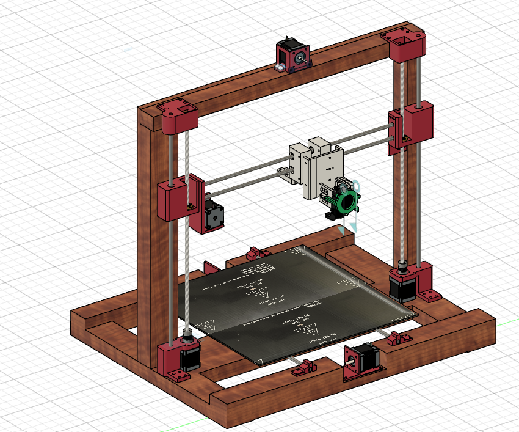

# Eco M3 Deep
It is my custom built 3D printer, with all custom 3D printed parts with large bed area.

I made this printer as it would help in making other projects as i don't have direct access to one, and i am interested more on hackclub events projects & science projects which constantly need custom 3D printed parts.

## Features 
    - Simplicity
    - Large Bed size with area of 40cmx40cm
    - Remote Extruder
    - The structure & large bed mount are made from wood to reduce cost
    - Expandable design for future additions

## Bill of Materials (BOM)

| Name                  | Description                                              | Unit Price (EGP) | Quantity | Total Price (EGP) | Link                                                                 |
|-----------------------|----------------------------------------------------------|------------------|----------|-------------------|----------------------------------------------------------------------|
| Stepper Motors        | Nema 17 Stepper motor 17hs8401s Usongshine 48mm (Black)  | 825              | 5        | 4125              | [Link](https://www.amazon.eg/-/en/gp/product/B0969CFKLM)             |
| Linear Rods           | Stainless Steel Linear Rod (8mm, 1m)                     | 260              | 3        | 780               | [Link](https://www.amazon.eg/-/en/gp/product/B09Z3QJF1P)             |
| Pulleys               | GT2 Timing pulley Bore 8mm with 20 Teeth Pulleys         | 80               | 2        | 160               | [Link](https://www.amazon.eg/-/en/gp/product/B0968ZPMWM)             |
| Remote Extruder       | MK8 All-Metal Remote Extruder for 3D Printer Parts       | 350              | 1        | 350               | [Link](https://www.amazon.eg/-/en/gp/product/B0968WV7D8)             |
| End Stop              | 3D Printer Mechanical End Stop Switch Module             | 89.99            | 3        | 269.9             | [Link](https://www.amazon.eg/-/en/gp/product/B0968R6TJ8)             |
| Motors Couplers       | 3D Printer and CNC Stepper Motor Flexible Coupling       | 105              | 2        | 210               | [Link](https://www.amazon.eg/-/en/gp/product/B0968ZBB2J)             |
| T8 Lead Screw         | T8 Thread Lead Screw 8mm, 2mm with Brass Nut (500mm)     | 295              | 2        | 590               | [Link](https://www.amazon.eg/-/en/gp/product/B0969HF39S)             |
| Linear Bearings       | LM8UU, 8mm, 6 Pieces                                     | 249              | 2        | 498               | [Link](https://www.amazon.eg/-/en/gp/product/B0968Y5C94)             |
| Timing Belt           | GT2 Timing belt 2mm pitch 6mm wide (2M)                  | 275              | 1        | 275               | [Link](https://www.amazon.eg/-/en/gp/product/B099DC5JK5)             |
| Hot End               | Full Metal J-Head CR10 Hotend Extruder Kit (24V 40W)     | 610              | 1        | 610               | [Link](https://www.amazon.eg/-/en/gp/product/B082WQVCKT)             |
| Power Supply          | 24V 10A                                                  | 595              | 1        | 595               | [Link](https://www.amazon.eg/-/en/gp/product/B0DR633KMW)             |
| SKR 1.4               | SKR V1.4 TURBO                                           | 2,999.00         | 1        | 2,999.00          | [Link](https://www.amazon.eg/-/en/gp/product/B09BMGXJ8S)             |
| Stepper Motors Drivers| TMC2209 V2 Stepper Motor Driver                          | 480              | 4        | 1920              | [Link](https://www.amazon.eg/-/en/gp/product/B0DJZL2XPQ)             |
| Heated Bed            | Aluminum Heated Bed for 3D Printer (400x200x3mm)         | 500              | 2        | 1000              | [Link](https://www.amazon.eg/-/en/gp/product/B099D8ZBVM)             |
| Bed Leveling Screws   | M3 Screw with Spring and Hand Knob (5 Pieces)            | 155              | 1        | 155               | [Link](https://www.amazon.eg/-/en/gp/product/B0968XHW56)             |

### **Total Cost**
- **Total (EGP):** 14,536.9  
- **Total (USD, as of 14/6/2025):** $292.45  