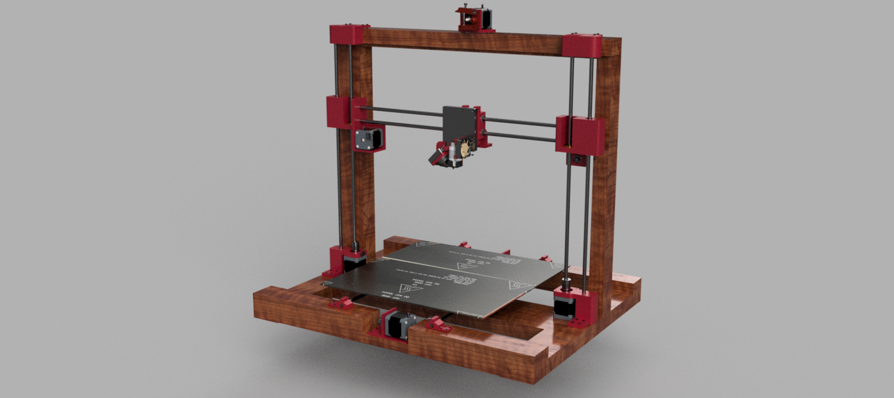

# Eco M3 Deep
It is my custom built 3D printer, with all custom 3D printed parts with large bed area.

I made this printer as it would help in making other projects as i don't have direct access to one, and i am interested more on hackclub events projects & science projects which constantly need custom 3D printed parts.

## Features 
    - Simplicity
    - Large Bed size with area of 40cmx40cm
    - Remote Extruder
    - The structure & large bed mount are made from wood to reduce cost
    - Expandable design for future additions

## Assembly
1. Mounts 

    - It is simple, start by putting linear bearings into the mounts specifically the moving z axis and the hotend mounts. 
2. Attachments
    -  Screw the hotend
    - Attach mechanical stops with the y axis motor, the same applies to the z axis bottom mount.
    - Screw the x axis bed motor onto its place.
    - Add the pulleys onto the motors shafts and onto a 3D printed small 8mm shaft that is connected to a 8mm bearing.
3. Structure
    - Make 7x 2x3cm wooden part with length of 50cm, put them together as in the image.
4. Axes assembly
    - Z axis
        - Connect the bottom z axis motor to the coupler and the coupler to the T8 lead screw.
        - Connect the T8 screw nut onto its place on the movable z axis middle mount.
        - Connect the upper z mount that has an 8mm bearing into the T8 screw.
        - Stabalize the structure by connecting the linear rod into its place through the three mounts.
        - The same applies on the other side
    - X axis
        - Mount the motors
        - Place the linear rods into their mounts 
        - Put the linear bearings into thier movable mounts.
        - Screw the movable mounts onto a 45x45cm wooden bed.
    - Y axis
        - Mount the hotend into its place
        - Connect the linear bearings
        - Screw the hotend mount onto the movable part.
5. Mechanism
    - Attach the timing belts to the mounts for z - x - y axes.
    - Connect all cables to the mainboard
6. Firmware
    - Install Marlin 2.0 firmware

## Bill of Materials (BOM)

| Name                  | Description                                                                 | Unit Price (EGP) | Quantity | Total Price (EGP) | Link |
|-----------------------|-----------------------------------------------------------------------------|------------------|----------|-------------------|------|
| Stepper Motors        | Nema 17 Stepper motor 17hs8401s Usongshine 48mm (Black)                    | 825              | 5        | 4125              | [Link](https://www.amazon.eg/-/en/gp/product/B0969CFKLM/ref=ox_sc_act_title_1?smid=A26I4OU0GDWZ7W&psc=1) |
| Linear Rods           | Stainless Steel Linear Rod (8mm, 1m)                                        | 260              | 3        | 780               | [Link](https://www.amazon.eg/-/en/gp/product/B09Z3QJF1P/ref=ox_sc_act_title_2?smid=A3G2ZVUBEERR0N&psc=1) |
| Pulleys               | GT2 Timing Pulley 20 teeth Bore 5mm 2 Pcs                                   | 149              | 2        | 298               | [Link](https://www.amazon.eg/-/en/gp/product/B0969JNT3G/ref=ox_sc_act_title_2?smid=A26I4OU0GDWZ7W&psc=1) |
| Remote Extruder       | MK8 All-Metal Remote Extruder for 3D Printer Parts - 1.75mm                 | 350              | 1        | 350               | [Link](https://www.amazon.eg/-/en/gp/product/B0968WV7D8/ref=ox_sc_act_title_4?smid=A26I4OU0GDWZ7W&psc=1) |
| End Stop              | 3D Printer Mechanical End Stop Switch Module                                | 89.99            | 3        | 269.9             | [Link](https://www.amazon.eg/-/en/gp/product/B0968R6TJ8/ref=ox_sc_act_title_5?smid=A1G5VPUVPXBMQ6&psc=1) |
| Motors Couplers       | 3D Printer and CNC Stepper Motor Flexible Coupling Coupler (5 to 8mm)       | 105              | 2        | 210               | [Link](https://www.amazon.eg/-/en/gp/product/B0968ZBB2J/ref=ox_sc_act_title_6?smid=A26I4OU0GDWZ7W&psc=1) |
| T8 Lead Screw         | T8 Thread Lead Screw 8mm, 2mm with Brass Nut (500mm)                       | 295              | 2        | 590               | [Link](https://www.amazon.eg/-/en/gp/product/B0969HF39S/ref=ox_sc_act_title_7?smid=A22MDF17B7GE04&psc=1) |
| Linear Bearings       | Linear Bearings 3D Printer, LM8UU, 8mm, 6 Pieces                            | 249              | 2        | 498               | [Link](https://www.amazon.eg/-/en/gp/product/B0968Y5C94/ref=ox_sc_act_title_8?smid=A3HOVOH12T9VII&psc=1) |
| Timing Belt           | GT2 Timing Belt 2mm Pitch 6mm Wide Rubber Opening (2M)                      | 275              | 1        | 275               | [Link](https://www.amazon.eg/-/en/gp/product/B099DC5JK5/ref=ox_sc_act_title_9?smid=A26I4OU0GDWZ7W&psc=1) |
| Hot End               | Full Metal J-Head CR10 Hotend Extruder Kit (24V 40W)                        | 610              | 1        | 610               | [Link](https://www.amazon.eg/-/en/gp/product/B082WQVCKT/ref=ox_sc_act_title_10?smid=A3HOVOH12T9VII&psc=1) |
| Power Supply          | Power Supply 24V 10A                                                        | 595              | 1        | 595               | [Link](https://www.amazon.eg/-/en/gp/product/B0DR633KMW/ref=ox_sc_act_title_11?smid=A2DMKAT7ZKLGQN&psc=1) |
| SKR 1.4              | SKR V1.4 TURBO                                                              | 2,999.00         | 1        | 2,999.00          | [Link](https://www.amazon.eg/-/en/gp/product/B09BMGXJ8S/ref=ox_sc_act_title_12?smid=A3HOVOH12T9VII&psc=1) |
| Stepper Motors Drivers | TMC2209 V2 Stepper Motor Driver                                            | 480              | 4        | 1920              | [Link](https://www.amazon.eg/-/en/gp/product/B0DJZL2XPQ/ref=ox_sc_act_title_15?smid=ANKKSL5YJGFAH&psc=1) |
| Heated Bed            | Aluminum Heated Bed for 3D Printer (400x200x3mm)                            | 500              | 2        | 1000              | [Link](https://www.amazon.eg/-/en/gp/product/B099D8ZBVM/ref=ox_sc_act_title_1?smid=A2TUHD4CZOFOST&psc=1) |
| Bed Leveling Screws   | M3 Screw with Spring and Hand Knob (5 Pieces)                               | 155              | 1        | 155               | [Link](https://www.amazon.eg/-/en/gp/product/B0968XHW56/ref=ewc_pr_img_1?smid=A22MDF17B7GE04&psc=1) |
| PLA Filament          | FUTURE ERA 3D Printing Filament 1.75mm \| 1Kg Roll (RED, PLA)               | 741.5            | 1        | 741.5             | [Link](https://www.amazon.eg/-/en/gp/product/B0F5X34KG2/ref=ewc_pr_img_1?smid=A3TF4AIIHFQJ8B&th=1) |
| Cooling Fan           | 3D 4010 Brushless Cooling Fan, 24V DC with Ball Bearing 2pin Connector      | 90               | 1        | 90                | [Link](https://www.amazon.eg/-/en/gp/product/B0DJ9R2ZJ3/ref=ewc_pr_img_1?smid=A2DMKAT7ZKLGQN&psc=1) |
| Thermistors           | 100K Ohm NTC 3950 Thermistor with Cable Dupont Head                         | 100              | 3        | 300               | [Link](https://www.amazon.eg/-/en/gp/product/B09MSPWTM5/ref=ewc_pr_img_1?smid=A26I4OU0GDWZ7W&psc=1) |
| 5mm Bearings          | uxcell 625-2RS Deep Groove Ball Bearing 5x16x5mm (10-Pack)                 | 216              | 1        | 216               | [Link](https://www.amazon.eg/-/en/gp/product/B07TML6YP4/ref=ox_sc_act_title_1?smid=A24L91U83A8RCR&psc=1) |
|Air blower             | DIY-Kit DC 12V Air blower,5cm Turbo blower,Humidifier fan,speed 4600RPM,3D Printer parts,cooling fan,Locking protection - 3D Printer 5015 Radial Turbo Blower 12Vdc Fan (SKU#1014) | 134.99 | 1 | 134.99 | [Link](https://www.amazon.eg/-/en/gp/product/B0D9TDTDCH/ref=ewc_pr_img_1?smid=A1G5VPUVPXBMQ6&psc=1)
,,,,,

**Total Cost:** 16157.39 EGP (~323.1 USD as of 18/6/2025)